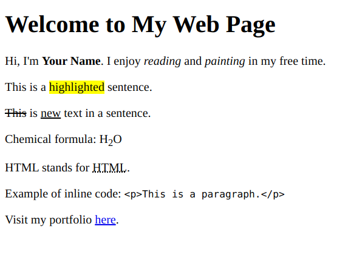

# **HTML Text Markup Practice Question**

Create an HTML document that demonstrates your understanding of text markup. Include the following elements to format and structure the provided content:

1. Make the title of the page "Text Markup Practice."
2. Create a main heading with the text "Welcome to My Web Page."
3. Write a paragraph introducing yourself. Emphasize your name using a strong tag and italicize your hobbies using an emphasis tag.
4. Highlight a specific sentence in the paragraph using the mark tag.
5. In a new paragraph, show a deleted text and an inserted text using appropriate tags.
6. Display a sentence with a superscript number for footnotes.
7. Abbreviate "HyperText Markup Language" as "HTML" using an abbreviation tag.
8. Provide an inline code example with the text "`
`This is a paragraph.`
`" using a code tag.

Remember to structure your HTML document correctly and use the appropriate text markup tags for each requirement. Test your document in a web browser to ensure the elements are displayed as intended.

Feel free to refer to HTML documentation and resources as needed. Good luck!

_(Note: The provided instructions focus solely on text markup elements within HTML.)_
