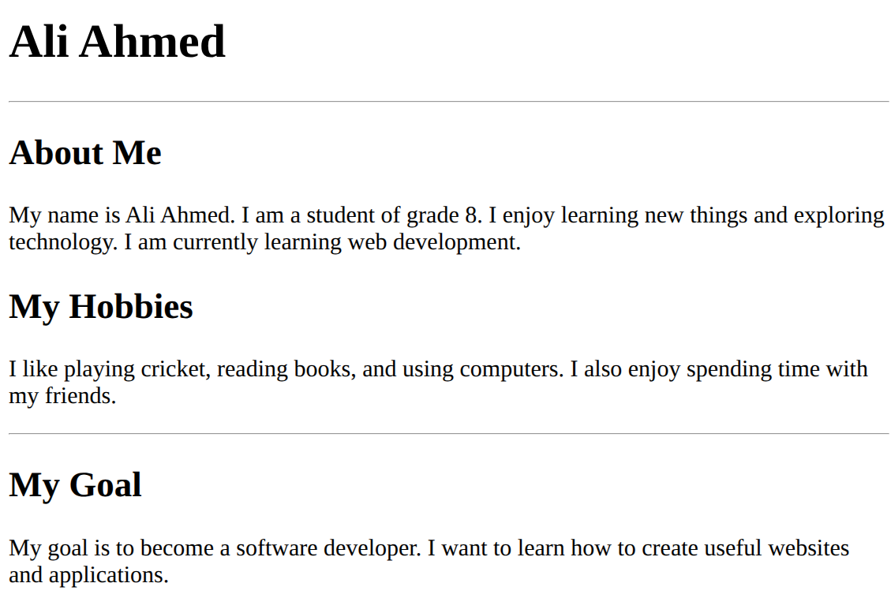

# HTML Assignment 01 — My Introduction Page

Create a simple **“About Me” webpage** using only the HTML tags learned in class.

## Requirements

Your webpage should contain:

1. `<h1>` — Your full name
2. `
` — A horizontal line
3. `<h2>` — About Me
4. `
` — Write 3–4 lines about yourself
5. `<h2>` — My Hobbies
6. `
` — Write about your hobbies
7. `
`
8. `<h2>` — My Goal
9. `
` — Write 2–3 lines about what you want to become in the future

**Allowed tags only:** `<h1>`, `<h2>`, `
`, `
`

**File name:** `index.html`

**Bonus:** Try to write the complete HTML yourself without using any help.

Remember to structure your HTML document correctly and use the appropriate text markup tags for each requirement. Test your document in a web browser to ensure the elements are displayed as intended.

Feel free to refer to HTML documentation and resources as needed. Good luck!

_(Note: The provided instructions focus solely on text markup elements within HTML, No CSS.)_
