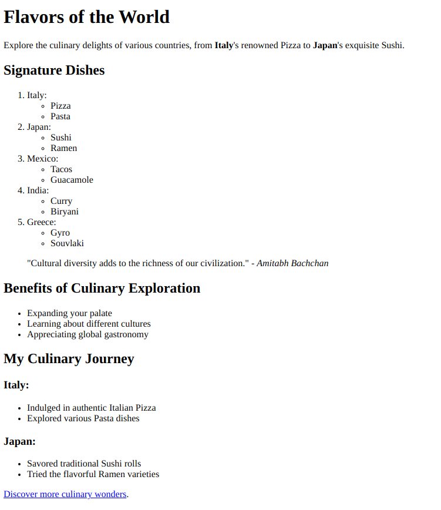

# **Practice Question: HTML Text Markup and Comprehensive Lists**

Your objective is to create an HTML document that showcases your adeptness with text markup and lists, including nested lists. Follow the instructions below to structure and format the provided content:

1. Set the document title as "Text Markup and In-depth Lists Challenge."

2. Create a heading titled "Flavors of the World."

3. Write a paragraph describing various international cuisines. Use the `<strong>` tag to emphasize the country names and the `<em>` tag to highlight notable dishes.

4. Organize the following countries and their signature dishes in an ordered list (`<ol>`):

   - Italy: Pizza, Pasta
   - Japan: Sushi, Ramen
   - Mexico: Tacos, Guacamole
   - India: Curry, Biryani
   - Greece: Gyro, Souvlaki

5. In a new paragraph, provide a quote about cultural diversity using the `<blockquote>` tag. Include a `<cite>` element to attribute the quote to its author.

6. Write a bullet-point list using the `<ul>` tag to enumerate the benefits of exploring global cuisines.

7. Create a subheading "My Culinary Journey" using appropriate heading tags.

8. Use nested lists to share your experiences trying international dishes. Each country's dishes should be represented as a sublist item.

Ensure your HTML document is properly structured and utilize suitable text markup and list tags for each requirement. Validate your document in a web browser to confirm that the elements are accurately displayed and formatted.

Challenge yourself by effectively using both text markup and comprehensive nested lists to communicate information and enhance readability. Best of luck!

_(Note: The provided instructions primarily focus on text markup and list formatting, including nested lists, within HTML.)_
