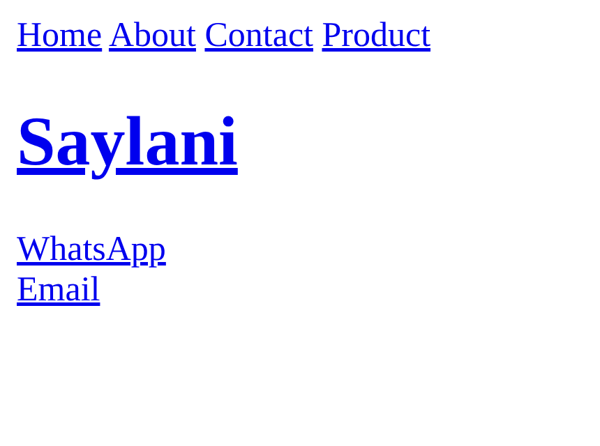

# Practice Question: HTML Links Mastery

Follow the instructions below:

1. Create 4 pages.
   - index.html (home page)
   - about.html
   - contact.html
   - product.html

1. Create appropriate links to connect each of the 4 page.

1. Create an heading which links to [saylaniwelfare.com](https://saylaniwelfare.com/) and opens in new page.

1. On the home page add links for:
   - Any youtube video
   - Email link (mailto:info@example.com)
   - WhatsApp ([wa.me/923033111499](https://wa.me/923033111499))

1. Extra: Create a link with the text **"Jump to top"** that links to the same page, using the appropriate anchor.

Ensure your HTML document is well-structured, formatted. Validate your document in a web browser to confirm that the elements are accurately displayed and formatted.

> 🎯 Challenge yourself and try to enhance user experience.

_(Note: The provided instructions primarily focus on text markup, list formatting, and various types of link usage within HTML only.)_
