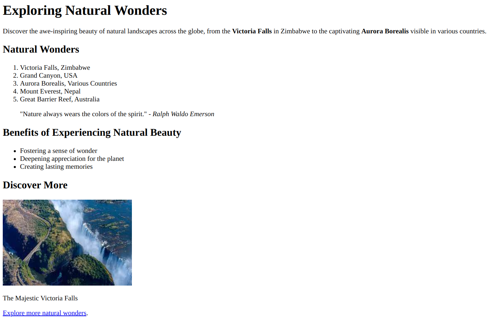

# **Practice Question: HTML Text Markup, Lists, Links, and Image Proficiency**

This exercise will evaluate your skills in text markup, lists, links, and image usage within HTML. Rigorously test the image section by covering all aspects of image incorporation. Follow the instructions below to structure and format the provided content:

1. Set the document title as "Text Markup, Lists, Links, and Image Challenge."

2. Begin with a heading "Exploring Natural Wonders."

3. Write a paragraph describing breathtaking natural landscapes around the world. Use the `<strong>` tag to emphasize the locations.

4. Organize the following natural wonders and their countries in an ordered list (`<ol>`):

   - Victoria Falls, Zimbabwe
   - Grand Canyon, USA
   - Aurora Borealis, Various Countries
   - Mount Everest, Nepal
   - Great Barrier Reef, Australia

5. In a new paragraph, provide a quote about the beauty of nature using the `<blockquote>` tag. Include a `<cite>` element to attribute the quote to its author.

6. Write a bullet-point list using the `<ul>` tag to enumerate the benefits of experiencing natural beauty.

7. Insert an image of the Grand Canyon. Use the image file "grand-canyon.jpg" and provide appropriate attributes including `alt`, `title`, `width`, and `height`.

8. Put the image in the `<figure>` tag and create a caption for the image using the `<figcaption>` tag. The caption should read "The Majestic Grand Canyon."

9. Insert an image link with the text "Explore Victoria Falls" that links to "https://www.example.com/victoria-falls."

Ensure your HTML document is well-structured and employs suitable text markup, list, link, and image tags for each requirement. Validate your document in a web browser to confirm that the elements are accurately displayed and formatted.

Challenge yourself by effectively using text markup, comprehensive lists, rigorous link testing, and thorough image integration to communicate information and enhance user experience. Good luck!

_(Note: The provided instructions focus primarily on text markup, list formatting, various types of link usage, and comprehensive image integration within HTML.)_
