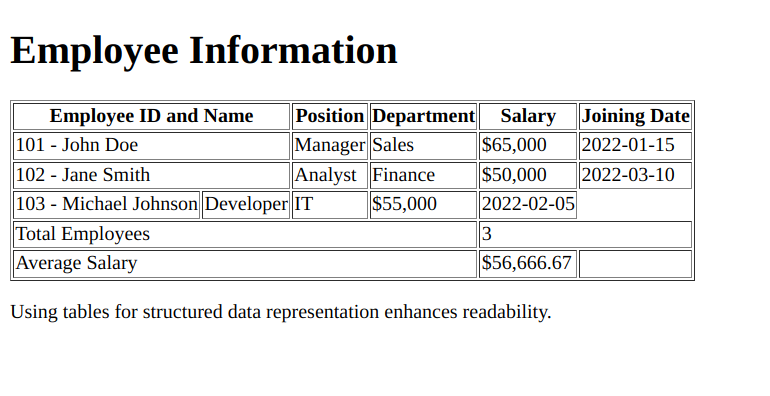

# **Practice Question: HTML Tables Mastery**

This exercise will evaluate your proficiency in creating HTML tables, covering a range of table features. Include headings, spanning columns and rows, and incorporating a table footer. Follow the instructions below to structure and format the provided content:

1. Set the document title as "HTML Tables Challenge."

2. Begin with a heading "Employee Information."

3. Design a table to present information about employees. Create the following columns: "Employee ID," "Name," "Position," "Department," "Salary," and "Joining Date."

4. Employ the `<th>` tag to establish table headings for each column.

5. Populate the table with data for three employees as follows:

   - Employee 1: ID 101, Name: John Doe, Position: Manager, Department: Sales, Salary: $65,000, Joining Date: 2022-01-15.
   - Employee 2: ID 102, Name: Jane Smith, Position: Analyst, Department: Finance, Salary: $50,000, Joining Date: 2022-03-10.
   - Employee 3: ID 103, Name: Michael Johnson, Position: Developer, Department: IT, Salary: $55,000, Joining Date: 2022-02-05.

6. Span the "Employee ID" and "Name" headings across two columns using the `colspan` attribute.

7. In the "Position" column of Employee 3, span two rows using the `rowspan` attribute.

8. Create a footer row using the `<tfoot>` element to display the average salary and total number of employees.

9. Ensure that each table cell is appropriately styled using the `border` attribute.

10. Conclude with a brief reflection on the significance of using tables for structured data representation.

11. Validate your HTML document in a web browser to confirm that the table is accurately displayed and formatted.

Test your understanding of various table elements to effectively present employee data in a structured and visually appealing manner. Best of luck!

_(Note: This practice question primarily focuses on HTML table creation and formatting.)_
