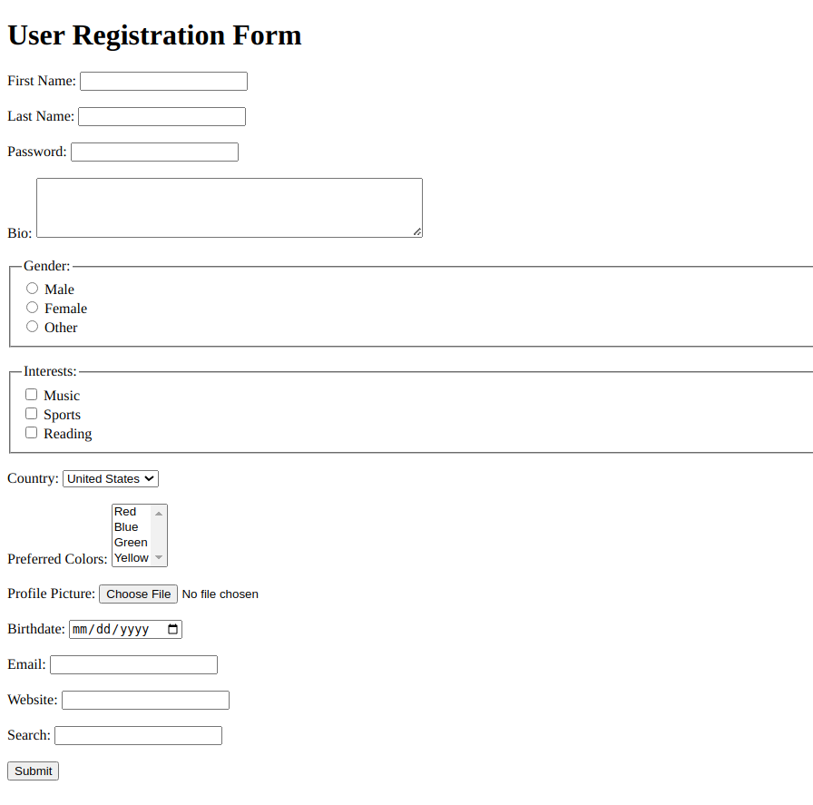

# **Practice Question: Comprehensive HTML Form Creation**

This exercise aims to evaluate your proficiency in creating HTML forms, covering various form elements and their features. Include text inputs, password inputs, text areas, radio buttons, checkboxes, dropdown list boxes, multiple select boxes, file inputs, submit buttons, labels, group elements, date inputs, form validation, email inputs, URL inputs, and search inputs. Follow the instructions below to structure and format the provided content:

1. Set the document title as "HTML Form Challenge."

2. Begin with a heading "User Registration Form."

3. Create a form that gathers user information, including:

   - First Name (text input)
   - Last Name (text input)
   - Password (password input)
   - Bio (text area)
   - Gender (radio buttons: Male, Female)
   - Interests (checkboxes: Music, Sports, Reading)
   - Country (dropdown list box: United States, Canada, Australia, Others)
   - Preferred Colors (color input)
   - Profile Picture (file input for images)
   - Birthdate (date input)
   - Email (email input)
   - Website (URL input)
   - Search (search input)

4. Include appropriate labels for each input element.

5. Implement basic form validation for required fields.

6. Conclude with a "Submit" button.

7. Validate your HTML document in a web browser to ensure the form functions correctly and is appropriately styled.

Utilize your understanding of HTML forms and their elements to effectively gather diverse user information. Good luck!

_(Note: This practice question primarily focuses on HTML form creation and element usage.)_
