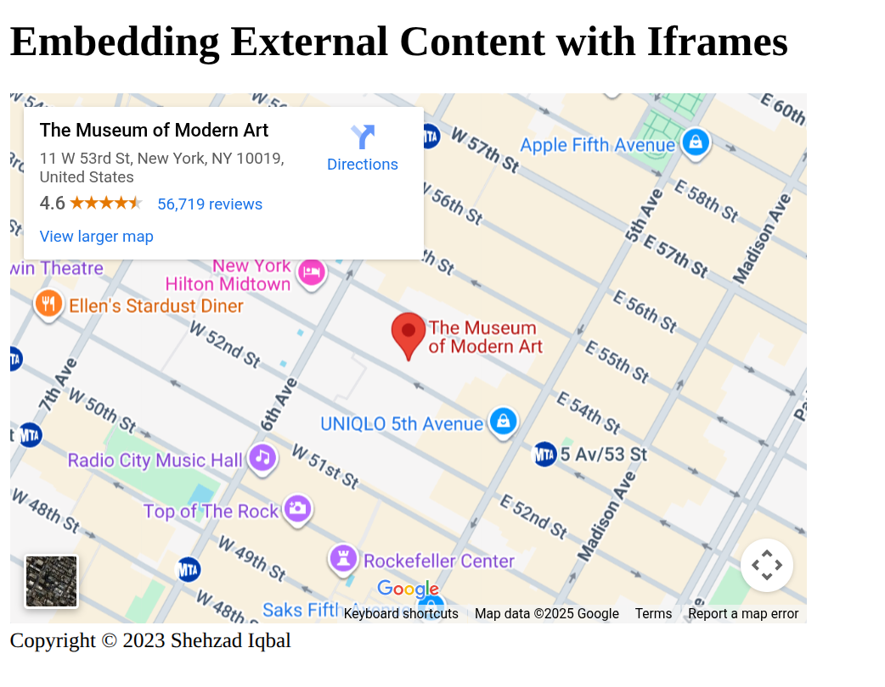

# **Practice Question: HTML Iframes**

1. Create an HTML document and within the document body:

   - Use a heading element to display the text "Embedding External Content with Iframes."

   - Below the heading, create an `<iframe>` element to embed an external webpage. Set the `src` attribute to "https://maps.google.co.uk/maps?q=moma+new+york&amp;output=embed".
     - Set the width to 600 pixels and the height to 400 pixels.
     - Add a title attribute with the text "External Content".

   - Add a footer with the text "Copyright © 2023 Your Name."

