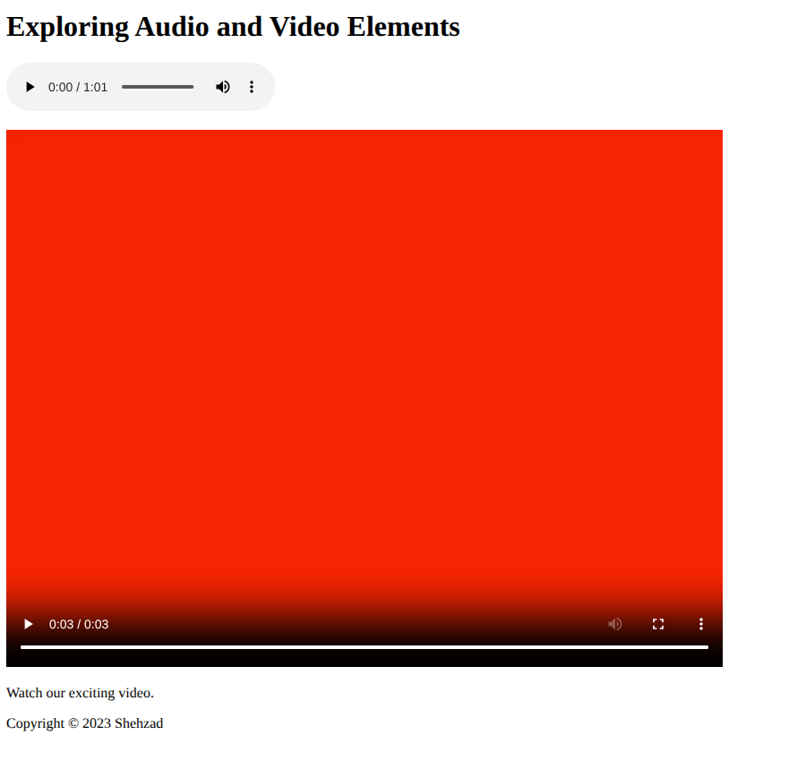

# **Practice Question: HTML Audio and Video Elements**

Create an HTML document to structure the content as described below:

1. Title the document "HTML Audio and Video Practice."

1. Use a heading element to display the text "Exploring Audio and Video Elements."

1. Below the paragraph, create an `<audio>` element with the following attributes:

   - `src`: Link to an audio file named "./ringtone.m4a".
   - `controls`: Display playback controls.

1. After the audio, create a `<video>` element with the following attributes:

   - `src`: Link to a video file named "video.mp4".
   - `controls`: Display playback controls.
   - Use attributes of `autoplay`, `muted` and `loop`.

1. Below the `<video>`, create a paragraph explaining the video: "Watch our exciting video."

1. Place the audio and video files in the same directory as your HTML file.
1. Add a footer with the text "Copyright © 2023 &lt;Your Name&gt;."
1. Add a [**Favicon**](https://www.w3schools.com/howto/howto_html_favicon.asp)
