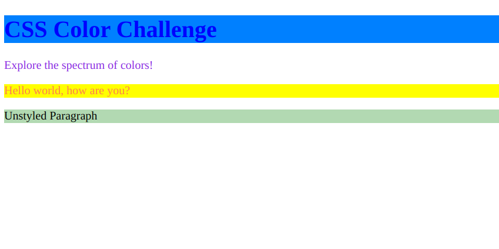

# Comprehensive CSS Color Practice

Here is what you have to make:


Get ready to dive into the vibrant world of CSS colors! This practice question will test your knowledge of different color concepts. Below is the given HTML structure:

```html
<!DOCTYPE html>
<html>
  <head>
    <link rel="stylesheet" type="text/css" href="styles.css" />
  </head>
  <body>
    <h1 id="main-title">CSS Color Challenge</h1>
    <p class="intro-paragraph">Explore the spectrum of colors!</p>
    <div id="color-box">Hello world, how are you?</div>
    <p>Unstyled Paragraph</p>
  </body>
</html>
```

In the `styles.css` file linked above, complete the following tasks:

a) Using the **Foreground Color Property**:
Set the font color of the element with the ID "main-title" to a vivid shade of blue.

b) Using the **Background Color Property**:
Give the background of the `<div>` with the ID "color-box" a soft yellow color.

c) Using **RGB Color Value**:
Apply an RGB color value of `rgb(255, 99, 71)` to the text of the paragraph with class "intro-paragraph".

d) Using **RGBA Color Value**:
Create a semi-transparent backdrop for the "Unstyled Paragraph" using the RGBA color value `rgba(0, 128, 0, 0.3)`.

e) Using **HSL Color Value**:
Use an HSL color value of `hsl(210, 100%, 50%)` to paint the background of the "main-title".

f) Using **Hex Color Code**:
Change the text color of the "intro-paragraph" to the hex color code `#8A2BE2`.

g) Using **Color Names**:
Finally, give the text within the "color-box" the color name "coral".

Your `styles.css` should reflect the changes for each task. Be sure to use the appropriate CSS properties and values for each concept.

Get creative and enjoy experimenting with colors!
