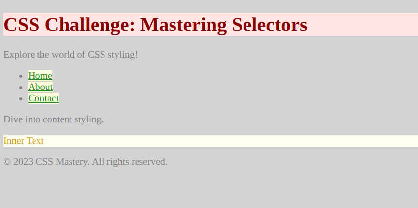

# Comprehensive CSS Selector Challenge: Colorful Styles

Here is what you have to make:


Welcome to the CSS Selector Challenge! This exercise will help you grasp the different selectors, understand cascading, and enhance your styling skills. Below is the provided HTML structure:

```html
<!doctype html>
<html>
  <head>
    <link rel="stylesheet" type="text/css" href="styles.css" />
  </head>
  <body>
    <header>
      <h1 id="main-title">CSS Challenge: Mastering Selectors</h1>
      <p class="intro-paragraph">Explore the world of CSS styling!</p>
    </header>
    <nav>
      <ul>
        <li><a class="nav-link" href="#">Home</a></li>
        <li><a class="nav-link" href="#">About</a></li>
        <li><a class="nav-link" href="#">Contact</a></li>
      </ul>
    </nav>
    <section>
      <p class="content-paragraph">Dive into content styling.</p>
      <div class="color-box">
        <p>Inner Text</p>
      </div>
    </section>
    <footer>
      <p>&copy; 2023 CSS Mastery. All rights reserved.</p>
    </footer>
  </body>
</html>
```

In your `styles.css` file, tackle the following challenges that encompass various selectors and cascading rules:

a) **Universal Selector**:
Set the font color of all elements to gray and the background color to lightgray.

b) **Element Selector**:
Change the font color of all `<h1>` elements to darkblue and the background color to lightcyan.

c) **ID Selector**:
Apply a font color of darkred and a background color of mistyrose to the element with the ID "main-title".

d) **Class Selector**:
Give all elements with the class "nav-link" a font color of forestgreen and a background color of lightyellow.

e) **Descendant Selector**:
Set the font color to saddlebrown and the background color to lemonchiffon for all `<p>` elements within `.color-box`.

f) **Child Selector**:
Give the text color a goldenrod hue and the background color an ivory shade for all `<p>` elements directly inside `.color-box`.

g) **Adjacent Sibling Selector**:
Apply a font color of teal and a background color of lightcyan to the `<p>` immediately following `.intro-paragraph`.

Your `styles.css` should showcase the cascading effects of these selectors, resulting in the final visual appearance. Remember, the order of your CSS rules matters, and understanding the cascade is key to successful styling.
