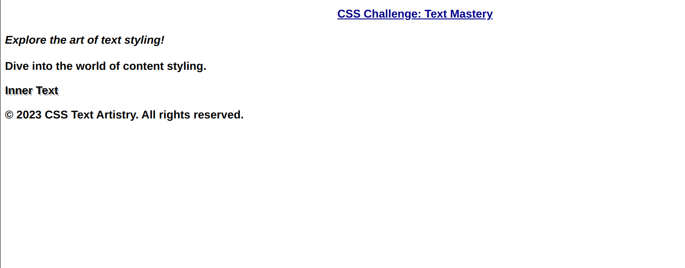

**CSS Text Styling Challenge: Mastering Text**

Here is what you have to make:


Welcome to the CSS Text Styling Challenge! This exercise will test your understanding of various text-related properties in CSS. Below is the provided HTML structure:

```html
<!doctype html>
<html>
  <head>
    <link rel="stylesheet" type="text/css" href="styles.css" />
  </head>
  <body>
    <header>
      <h1 id="main-title">CSS Challenge: Text Mastery</h1>
      <p class="intro-paragraph">Explore the art of text styling!</p>
    </header>
    <section>
      <p class="content-paragraph">Dive into the world of content styling.</p>
      <div class="color-box">
        <p>Inner Text</p>
      </div>
    </section>
    <footer>
      <p>&copy; 2023 CSS Text Artistry. All rights reserved.</p>
    </footer>
  </body>
</html>
```

In your `styles.css` file, take on the following challenges that test your knowledge of text styling:

a) Apply a font size of 20px and a font family of "Arial, sans-serif" to all elements.

b) Change the color of all `<h1>` elements to darkblue and give them a text alignment of center.

c) Apply a font weight of bold and a text decoration of underline to the element with the ID "main-title".

d) Give all elements with the class "intro-paragraph" a font style of italic and increase the line height to 1.5.

e) Set the text transform of all elements within `.content-paragraph` to uppercase.

f) Emphasize the first word of every `<p>` element by applying a font weight of bold.

g) Change the color of the link texts (`.nav-link`) to forestgreen and remove the default underline.

h) Apply a text shadow to the text within `.color-box p` with a horizontal offset of 2px, a vertical offset of 2px, and a color of rgba(0, 0, 0, 0.3).

Your `styles.css` should demonstrate your ability to manipulate text styling using various CSS properties.
