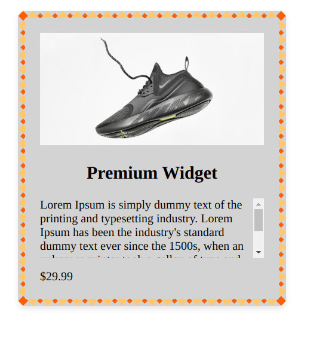

# **CSS Text and Box Styling Challenge: Designing a Product Card**

Here is what you have to make:


Welcome to the CSS Text and Box Styling Challenge! In this exercise, you'll have the opportunity to apply various CSS properties to create an aesthetically pleasing product card design. Below is the HTML structure for a product card:

```html
<!doctype html>
<html>
  <head>
    <link rel="stylesheet" type="text/css" href="styles.css" />
  </head>
  <body>
    <div class="product-card">
      
      <h2 class="product-title">Premium Widget</h2>
      <p class="product-description">
        Lorem Ipsum is simply dummy text of the printing and typesetting
        industry. Lorem Ipsum has been the industry's standard dummy text ever
        since the 1500s, when an unknown printer took a galley of type and
        scrambled it to make a type specimen book. It has survived not only five
        centuries, but also the leap into electronic typesetting, remaining
        essentially unchanged. It was popularised in the 1960s with the release
        of Letraset sheets containing Lorem Ipsum passages, and more recently
        with desktop publishing software like Aldus PageMaker including versions
        of Lorem Ipsum.
      </p>
      <span class="product-price">$29.99</span>
    </div>
  </body>
</html>
```

In your `styles.css` file, take on the following challenges that encompass various text and box styling concepts:

a) Set the background color of the product card to a light gray.

b) Give an appropriate width and height to the product image.

c) Add a box shadow to the product card for a subtle depth effect.

d) Apply rounded corners to the product card to soften its edges.

e) Set a fixed width of 300px and center align the product card.

f) Add a margin around the product card to provide spacing from other elements.

g) Increase the font size of the product title and align it to the center.

h) Apply a border to the product card with a different color and thickness.

i) Use padding to create spacing between the content and the border.

j) Set a maximum height for the product description with scrolling overflow when content exceeds the height.

k) Adjust the visibility property to hide the price initially and display it on hover.

l) Incorporate a border image to add a decorative element around the card.

m) Utilize min-height to ensure the product card has a minimum height even when the content is small.

Your `styles.css` should reflect your creativity in applying these styling concepts to create an appealing product card design. Imagine you're designing a webpage that showcases various products, and this product card will catch users' attention. Experiment with these properties to achieve an appealing and functional design.
