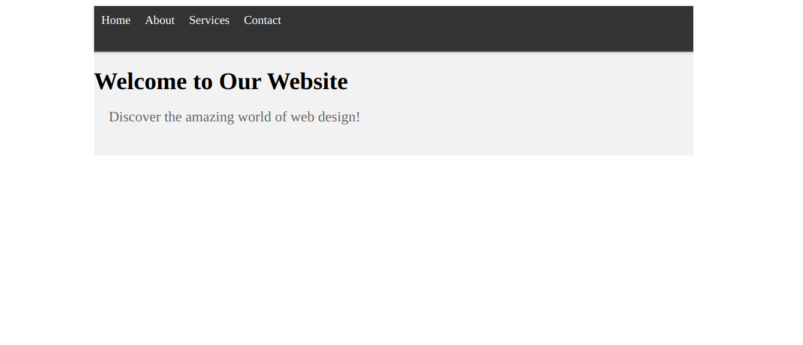

**CSS Text, Box, and Navbar Styling Challenge: Designing a Homepage**


Here is what you have to make:



Welcome to the CSS Text, Box, and Navbar Styling Challenge! In this exercise, you'll have the opportunity to apply various CSS properties to create an appealing homepage design with a navigation bar. Your task is to design the header section of a homepage, complete with a navigation bar. Below is the HTML structure for your homepage:

```html
<!DOCTYPE html>
<html>
  <head>
    <link rel="stylesheet" type="text/css" href="styles.css" />
  </head>
  <body>
    <header>
      <nav class="navbar">
        <ul>
          <li><a href="#">Home</a></li>
          <li><a href="#">About</a></li>
          <li><a href="#">Services</a></li>
          <li><a href="#">Contact</a></li>
        </ul>
      </nav>
      <h1 class="main-title">Welcome to Our Website</h1>
      <p class="sub-title">Discover the amazing world of web design!</p>
    </header>
  </body>
</html>
```

In your `styles.css` file, take on the following challenges that encompass various text and box styling concepts, without using flex:

a) Apply a background color to the header to create a visual separation.

b) Set a fixed width for the header and center align it on the page.

c) Create a navigation bar by styling the `<nav>` element with a background color, padding, and a bottom border.

d) Apply a box shadow to the navigation bar for depth.

e) Set a specific height for the navigation bar and vertically align its contents.

f) Increase the font size of the navigation links.

g) Add some margin to the navigation links for spacing.

h) Style the main title by increasing its font size and applying bold text.

i) Use a sub-title class to give the sub-title paragraph a different font size and color.

j) Set a minimum height for the header to ensure it maintains a certain height.

k) Apply a top and bottom margin to the main title.

l) Apply a right and left padding to the sub-title.

Your `styles.css` should showcase your creativity in designing a homepage header with a navigation bar. Imagine you're creating the first impression of a website for visitors. Experiment with these properties to achieve an appealing and user-friendly design. Good luck on crafting an engaging homepage!
