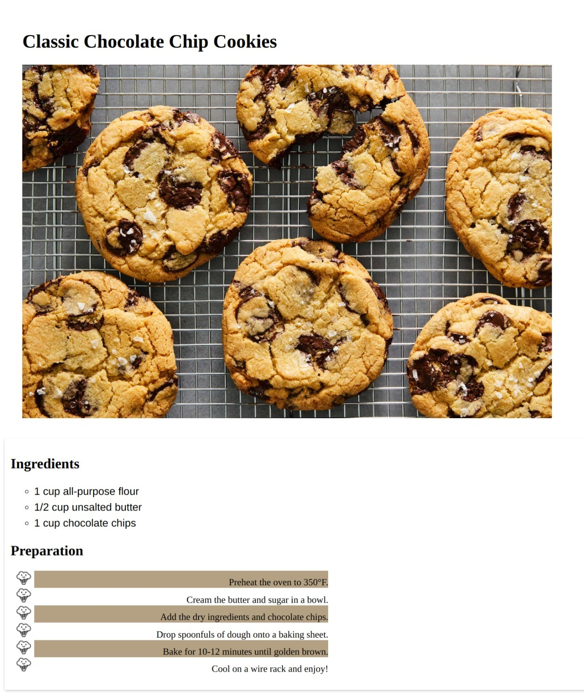

**CSS List Styling Challenge: Designing a Recipe Page**

Here is what you have to make:


Welcome to the CSS List Styling and Text Manipulation Challenge! In this exercise, you'll apply various CSS properties to create a practical and visually appealing recipe webpage. Your task is to design a webpage that showcases a delicious recipe, complete with a list of ingredients and preparation steps. Below is the HTML structure for the recipe webpage:

```html
<!doctype html>
<html>
  <head>
    <link rel="stylesheet" type="text/css" href="styles.css" />
  </head>
  <body>
    <header>
      <h1>Classic Chocolate Chip Cookies</h1>
      
    </header>
    <section class="recipe-details">
      <h2>Ingredients</h2>
      <div class="ingredients">
        <ul class="unordered-list">
          <li>1 cup all-purpose flour</li>
          <li>1/2 cup unsalted butter</li>
          <li>1 cup chocolate chips</li>
        </ul>
      </div>
      <h2>Preparation</h2>
      <ol class="ordered-list">
        <li>Preheat the oven to 350°F.</li>
        <li>Cream the butter and sugar in a bowl.</li>
        <li>Add the dry ingredients and chocolate chips.</li>
        <li>Drop spoonfuls of dough onto a baking sheet.</li>
        <li>Bake for 10-12 minutes until golden brown.</li>
        <li>Cool on a wire rack and enjoy!</li>
      </ol>
    </section>
  </body>
</html>
```

In your `styles.css` file, take on the following challenges that encompass various list styling concepts, text manipulation, font, margin, padding, and more:

a) Give a fixed width of 900px to cookie image.

b) Style the unordered list (`ul`) to have circle markers and a different font.

c) Apply a custom background image to the ordered list (`ol`) as the list item marker.

d) Position the list item markers outside the list items for both ordered and unordered lists.

e) Increase the font size of the ingredients' list items.

f) Add a margin and padding to the header for spacing.

g) Set a unique background color to every odd list item in the preparation steps.

h) Apply a custom font family to the header.

i) Adjust the line height of the ingredients' list items.

k) Add a subtle box shadow to the recipe details section and give it some padding.

k) Align the text in the ordered list to the right side and give with a width of 500px.

Your `styles.css` should creatively combine these properties to design an attractive and user-friendly recipe webpage. Imagine you're creating a webpage that not only presents a delicious recipe but also engages the user with a visually appealing layout. Have fun crafting the perfect recipe page!
