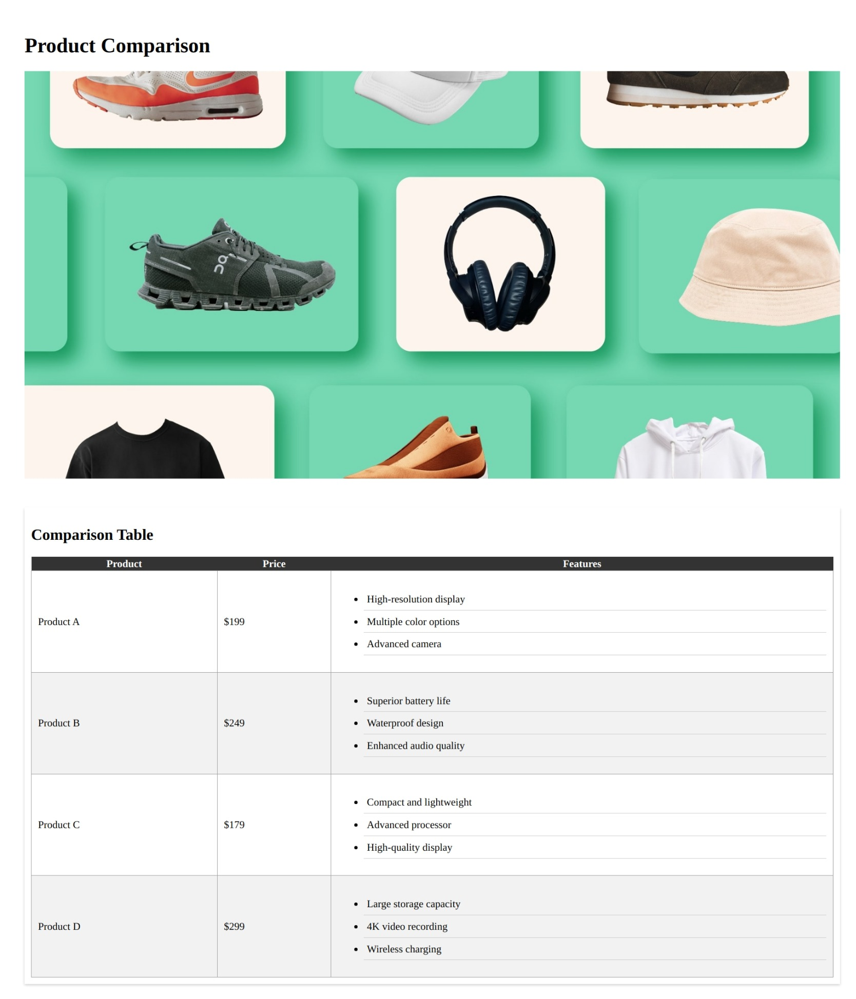

**CSS Table Challenge: Designing a Product Comparison Page**

Here is what you have to make:

Welcome to the CSS Table and List Styling Challenge! In this exercise, you'll apply various CSS properties to design a practical and visually appealing product comparison page. Your task is to create a webpage that allows users to compare features of different products using a table.

In your `styles.css` file, take on the following challenges that encompass various table and list styling concepts, as well as text manipulation, font, margin, padding, and more:

a) set width of image to 100%.

b) Collapse the table borders.

c) set width of table to 100%.

d) Give appropriate border and padding to td.

e) Style the table header cells with a different background color and font color.

f) Add a margin and padding to the header for spacing.

g) Set a unique background color to every even row in the table.

h) Apply a custom font family to the header.

i) Adjust the line height of the list items.

j) Add a subtle box shadow to the product comparison section.

k) Give margin of 30px and padding of 10px to product comparison section.

l) Add a border and padding to the unordered list items.

Your `styles.css` should creatively combine these properties to design an attractive and user-friendly product comparison page. Imagine you're creating a webpage that helps users make informed decisions about their purchases. Enjoy crafting the perfect product comparison page!
