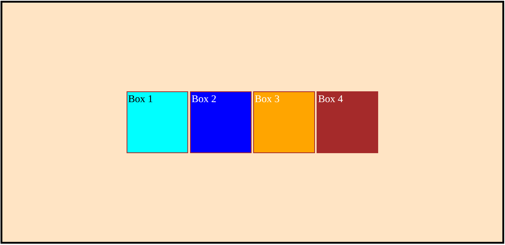
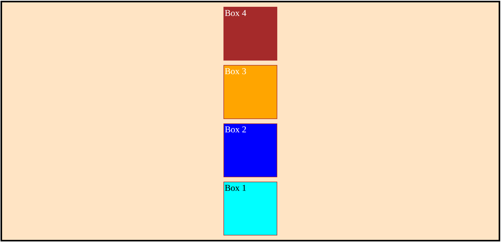
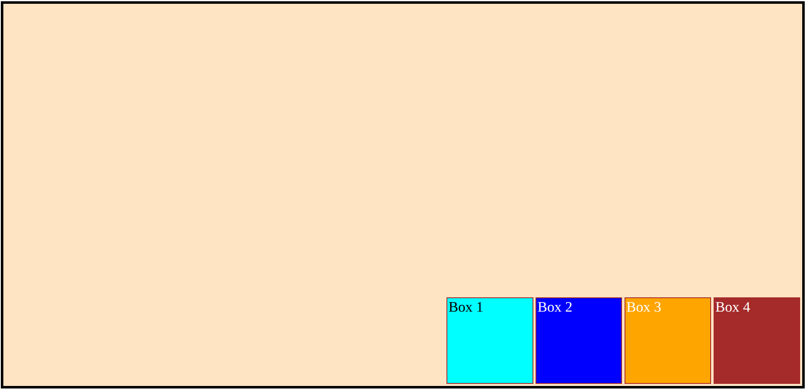
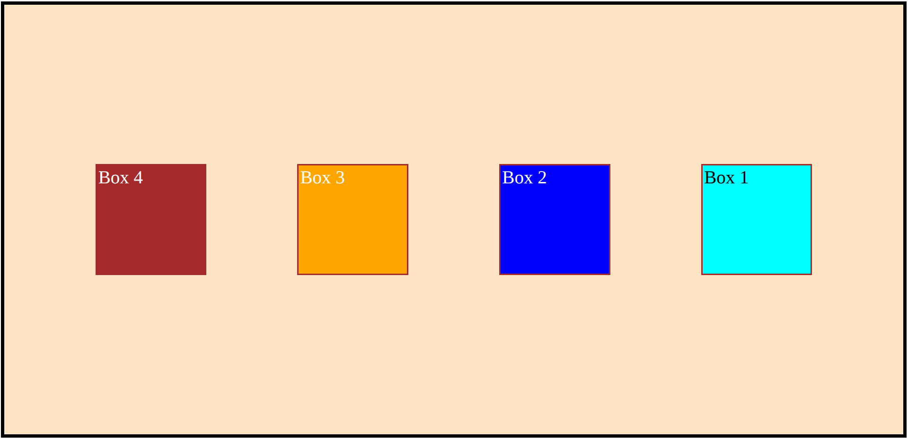
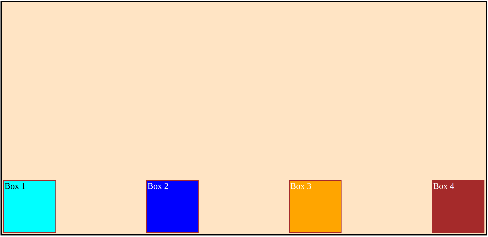
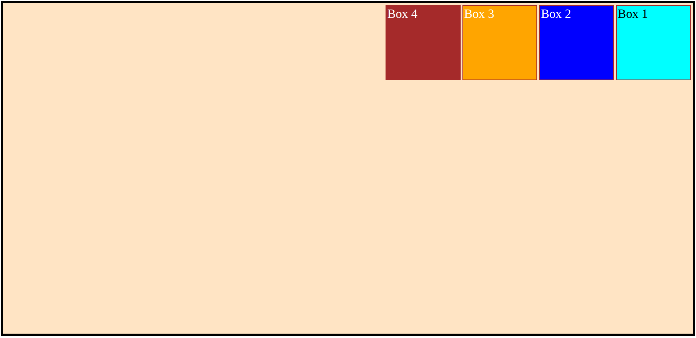
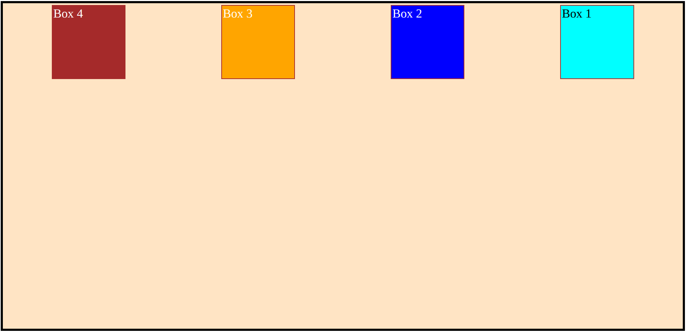

# Flexbox Practice

Use the given template below and recreate all designs below:

```html
<!doctype html>
<html lang="en">
  <head>
    <meta charset="UTF-8" />
    <meta name="viewport" content="width=device-width, initial-scale=1.0" />
    <title>Document</title>
    <style>
      /* https://css-tricks.com/snippets/css/a-guide-to-flexbox/ */

      .container {
        background-color: bisque;
        min-height: 98vh;
        border: 5px solid black;
        margin: 2px;
        padding: 2px;
      }
      .box {
        height: 100px;
        width: 100px;
        border: 2px solid brown;
        margin: 2px;
        padding: 2px;

        color: white;
        font-size: 25px;
      }

      #box1 {
        background-color: aqua;
        color: black;
      }
      #box2 {
        background-color: blue;
      }
      #box3 {
        background-color: orange;
      }
      #box4 {
        background-color: brown;
      }
      /* write code below */

      /* write code above */
    </style>
  </head>
  <body>
    <div class="container">
      <div class="box" id="box1">Box 1</div>
      <div class="box" id="box2">Box 2</div>
      <div class="box" id="box3">Box 3</div>
      <div class="box" id="box4">Box 4</div>
    </div>
  </body>
</html>
```

## Task 1



## Task 2



## Task 3



## Task 4



## Task 5



## Task 6



## Task 7


